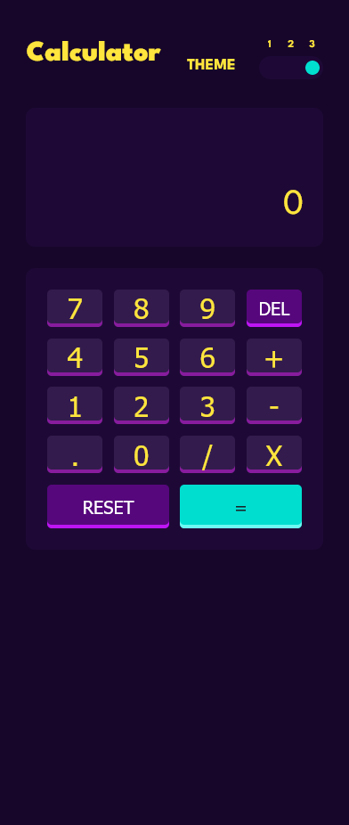
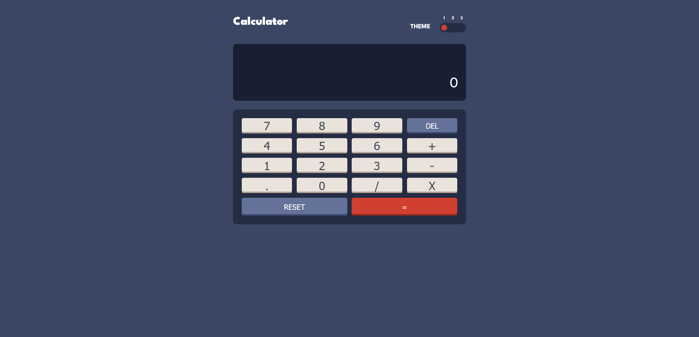
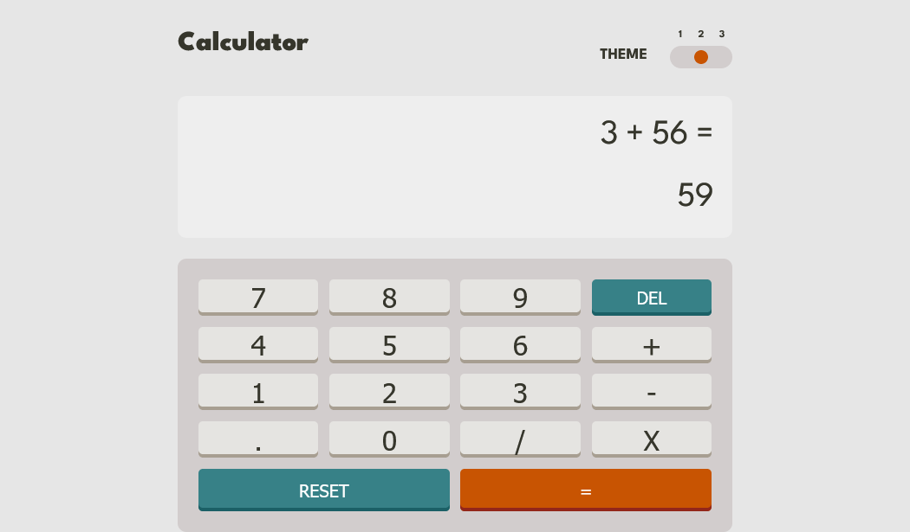

# Calculator app project

This project has been created as a solution to the [Calculator app challenge on Frontend Mentor](https://www.frontendmentor.io/challenges/calculator-app-9lteq5N29).

## Table of contents

-   [Overview](#overview)
    -   [Description](#description)
    -   [Screenshot](#screenshot)
    -   [Links](#links)
-   [My process](#my-process)
    -   [Built with](#built-with)
    -   [Continued development](#continued-development)
    -   [Useful resources](#useful-resources)
-   [Author](#author)
-   [Acknowledgments](#acknowledgments)

## Overview

### Description

This is a simple calculator application built using react with the following features:

-   Responsive UI: Users are able to see the size of elements adjust based on screen size
-   Immediate Execution Logic: Users are able to perform basic mathematical operations such as addition, subtraction, multiplication and division. Results shown are based on an immediate execution logic.
-   Switchable Theme: Users are able to adjust the color theme based on their preference. An intial theme is set based on system settings and additional changes to the preferences are saved in the browser.

### Screenshot

### Links

-   [Github URL](https://github.com/joeehis1/Calculator-Application)
-   [Live Site URL](https://simpulcalk.netlify.app/)

## My process

-   Defining the minimal amount of markup and styling that would allow for implementation of the calculator logic
-   Implementing the logic for the calculator operations including inputting values and generating results
-   Finishing the markup and styling
-   Implementing some additional logic for accessibility and general refactoring.

### Built with

-   [Sass](https://sass-lang.com/) - CSS Preprocessor
-   [React](https://reactjs.org/) - JS library

### Continued development

My intent with this application is to eventually incorporate more operations to make it a full fledged scientific calculator, and do more interface improvements to allow for this.

### Useful resources

-   [Detecting Dark Mode in javascript](https://ultimatecourses.com/blog/detecting-dark-mode-in-javascript) - This is an article that provides some explanation on how to detect a user's preselected theme settings. These are normally set from the OS or the browser and the windows.matchMedia method if available gives you a way to determine if a user has dark mode set or not.

## Author

-   Website - [Joseph Ehigiator](https://ehis-portfolio.netlify.app/)
